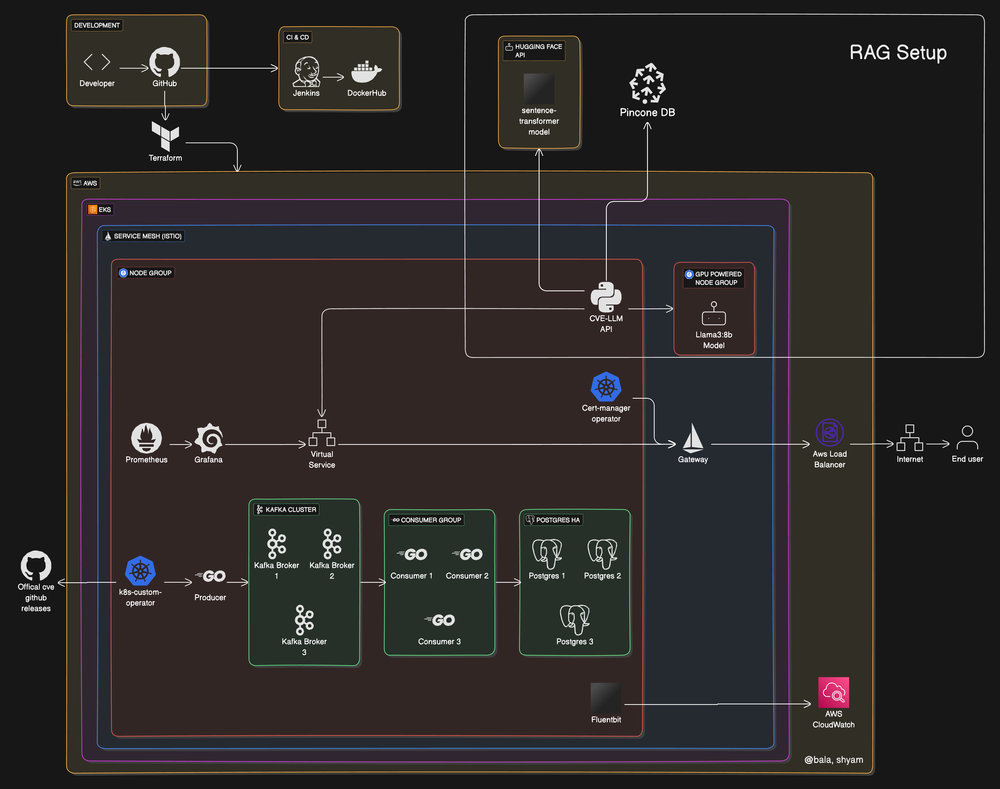

# Distributed Microservices Integrated with LLM

## Architecture Diagram

## Demo

[Watch a quick demo of the application](https://youtu.be/jkzQnEUMvHI?si=NxZph4j6Q6hNgNns)

## About

This is a robust data streaming system that streams over 240000+ records of the CVE (Common Vulnerabilities and Exposures) data, through 𝗞𝗮𝗳𝗸𝗮 to store it in 𝗣𝗼𝘀𝘁𝗴𝗿𝗲𝗦𝗤𝗟 database. The stored CVE data is then utilized as part of the RAG (𝗥𝗲𝘁𝗿𝗶𝗲𝘃𝗮𝗹-𝗔𝘂𝗴𝗺𝗲𝗻𝘁𝗲𝗱 𝗚𝗲𝗻𝗲𝗿𝗮𝘁𝗶𝗼𝗻) pipeline to power a self-hosted LLM which can answer queries specific to the CVE data. The whole infrastructure is built on top of 𝗞𝘂𝗯𝗲𝗿𝗻𝗲𝘁𝗲𝘀, utilizing 𝗔𝗺𝗮𝘇𝗼𝗻 𝗘𝗞𝗦.

Here are some of the key aspects of our architecture:

- CI/CD - Implemented 𝗝𝗲𝗻𝗸𝗶𝗻𝘀 which monitors multiple repositories to lint the code, automate the 𝗱𝗼𝗰𝗸𝗲𝗿 𝗶𝗺𝗮𝗴𝗲 builds and handles semantic releases of the helm packages.

- Microservices - The setup includes multiple microservices, built using 𝗚𝗼𝗟𝗮𝗻𝗴.

- Scalability - Implemented pod level 𝗮𝘂𝘁𝗼 𝘀𝗰𝗮𝗹𝗲𝗿 to individually scale each microservice in the architecture and implemented 𝗰𝗹𝘂𝘀𝘁𝗲𝗿 𝗹𝗲𝘃𝗲𝗹 auto scaler to scale at kubernetes node level.

- Availability - Placed the pods across different AWS availability zones to ensure 𝗳𝗮𝘂𝗹𝘁 𝘁𝗼𝗹𝗲𝗿𝗮𝗻𝗰𝗲.

- Reliability - Implemented 𝗹𝗶𝘃𝗲𝗻𝗲𝘀𝘀 and 𝗿𝗲𝗮𝗱𝗶𝗻𝗲𝘀𝘀 𝗽𝗿𝗼𝗯𝗲𝘀 to keep the application resilient against failures.

- Security - Followed 𝗣𝗼𝗟𝗣 (Principle of Least Privilege) and used appropriate IAM roles, trust relationships, k8s secrets, service accounts and RBAC. Provided secure access with 𝗦𝗦𝗟 𝗰𝗲𝗿𝘁𝗶𝗳𝗶𝗰𝗮𝘁𝗲𝘀 managed through k8s cert-manager operator.

- Custom Kubernetes operator - Developed a 𝗰𝘂𝘀𝘁𝗼𝗺 𝗸𝟴𝘀 𝗼𝗽𝗲𝗿𝗮𝘁𝗼𝗿 to monitor the latest CVE releases and to keep the cve postgres database updated automatically with the latest changes via k8s CRs.

- Service Mesh - Implemented a service mesh across the whole kubernetes cluster through 𝗜𝘀𝘁𝗶𝗼 to control and monitor the traffic flow between components while securing the internal communication within the infrastrucutre

- Logging - Collected logs across the cluster using 𝗙𝗹𝘂𝗲𝗻𝘁𝗯𝗶𝘁 in JSON and pushed them to 𝗔𝗪𝗦 𝗖𝗹𝗼𝘂𝗱𝗪𝗮𝘁𝗰𝗵

- Monitoring - Used 𝗣𝗿𝗼𝗺𝗲𝘁𝗵𝗲𝘂𝘀 to collect metrics and 𝗚𝗿𝗮𝗳𝗮𝗻𝗮 to display them publicly through dashboards.

- Deployment - Used 𝗛𝗲𝗹𝗺 to manage application deployment on k8s and 𝗧𝗲𝗿𝗿𝗮𝗳𝗼𝗿𝗺 to manage infrastructure deployment through code.

- RAG - Implemented a RAG pipeline integrating 𝗛𝘂𝗴𝗴𝗶𝗻𝗴 𝗳𝗮𝗰𝗲 API and Pinecone Database, along with using a 𝗟𝗹𝗮𝗺𝗮𝟯:𝟴𝗕 𝗺𝗼𝗱𝗲𝗹 𝘀𝗲𝗹𝗳-𝗵𝗼𝘀𝘁𝗲𝗱 in 𝗞𝘂𝗯𝗲𝗿𝗻𝗲𝘁𝗲𝘀 to generate responses based on CVE data.

- Implemented data versioning, while storing the data in PostgreSQL to have different versions of CVE historical data and to track the periodic changes in the data over time. Implemented indexing to improve the querying speed.

## Contributors

- [Shyam Sundar Mylai](https://github.com/shyam2520)
- [Balasubramanian Ulaganathan](https://github.com/BalasubramanianU)
